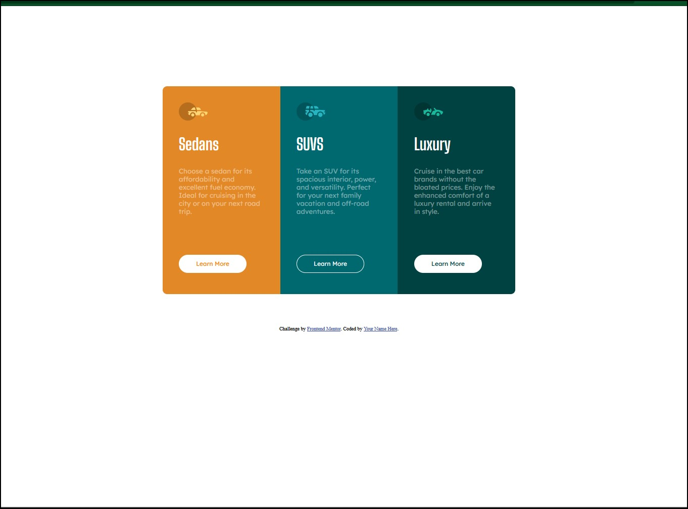

# Frontend Mentor - 3-column preview card component solution

This is a solution to the [3-column preview card component challenge on Frontend Mentor](https://www.frontendmentor.io/challenges/3column-preview-card-component-pH92eAR2-). Frontend Mentor challenges help you improve your coding skills by building realistic projects. 

## Table of contents

- [Overview](#overview)
  - [The challenge](#the-challenge)
  - [Screenshot](#screenshot)
  - [Links](#links)
- [My process](#my-process)
  - [Built with](#built-with)
  - [What I learned](#what-i-learned)
  - [Continued development](#continued-development)
  - [Useful resources](#useful-resources)
- [Author](#author)
- [Acknowledgments](#acknowledgments)


### The challenge

Users should be able to:

- View the optimal layout depending on their device's screen size
- See hover states for interactive elements

### Screenshot



### Links

- Solution URL: [GITHUB REPO](https://github.com/gurkenpoo/cardsStyle02)
- Live Site URL: [Add live site URL here](https://your-live-site-url.com)

## My process
- first structure the HTML
- add semantic elements
- create flex containers and cards
- start aplying style with css
- add pseudo selectors 
- add media queries
### Built with

- Semantic HTML5 markup
- CSS custom properties
- Flexbox 
- Flex Wrap
- desktop-first workflow

### What I learned

i learned that use Flex in card style sites is worth it. using generic class is a very good practice to avoid rewritte code, instead of reuse code.


```html
<section class="card sedans"> 
      
       <h1 class="cardTitle">Sedans</h1>
      <span class="cardText">Choose a sedan for its affordability and excellent fuel economy. Ideal for cruising in the city 
      or on your next road trip.</span>
      <a href="https://youtu.be/dQw4w9WgXcQ" class="buttonLink"><button class="button buttonSedans">Learn More</button></a>
    </section>
```
```css
.button:hover{
    cursor: pointer;
    background-color: rgba(255, 255, 255, 0);
    border: 1px solid #fff;
    color: #fff;
}
```

### Continued development

I want to continue studing pseudo selectors and css animations, is a very weak area that i have.

### Useful resources

- [Border and Shadow generator](https://neumorphism.io/#e0e0e0) - This helped me for structure the radius and the shadows.
- [Semantic Elements](https://www.w3schools.com/html/html5_semantic_elements.asp) - This is an amazing article which helped me to never foget about the Semantic Elements (VERY GOOD PRACTICE).

## Author

- Website - [gurkenpoo](https://github.com/gurkenpoo)
- Frontend Mentor - [@gurkenpoo](https://www.frontendmentor.io/profile/gurkenpoo)
- Twitch - [@gurkenpoo](https://www.twitch.tv/gurkenpoo)


## Acknowledgments

Im not an advanced dev user, i only want to let you know that you have to make and make and make every site, every challenge to start learning and understanding more faster and safer. Always grateful with the people in twitch who pass in my streams and gave me a hand in everything they can.
